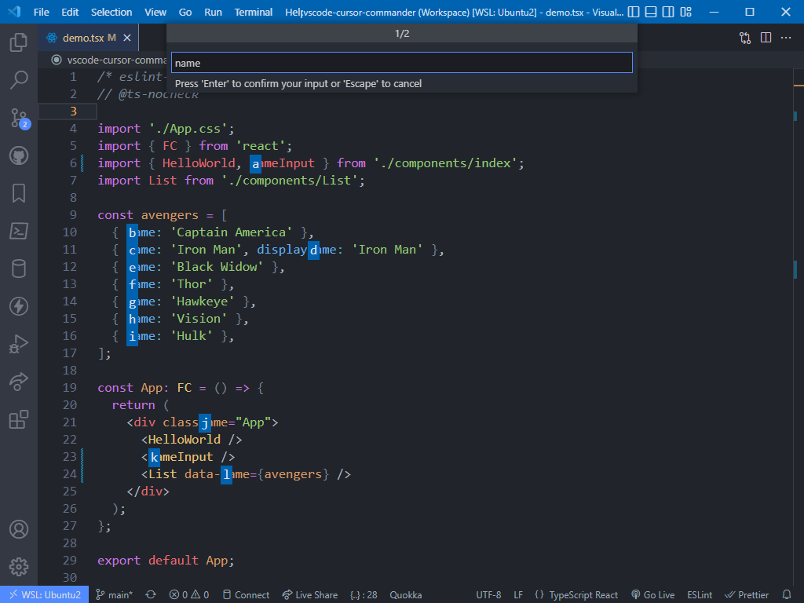

# [Cursor Commander](https://marketplace.visualstudio.com/items?itemName=skafau.cursor-commander)

Inspired by extensions like Jumpy, Cursor Jump or Ace Jump. Needs more keystrokes but provides more power in form of jump commands like select string, block, word etc. at jump target.

# Usage

- Start extension using its shortcut (e.g. `Ctrl+.`)
- Enter search term which can be 1 - x characters long -> `Enter`
- Enter token which is shown above the search term + (optional) command sequence -> `Enter`  
  E.g. `c sb` to select the block surrounding jump target `c`

# Commands & Settings

## Commands

- `cursor-commander.start-blank`: Bound to `Ctrl+.` by default
- `cursor-commander.show-all-line-targets`: Bound to `Ctrl+,` by default

## Settings (Command sequences)

- `cursor-commander.commands.showLineStarts`: Default `1`
- `cursor-commander.commands.showCodeStarts`: Default `2`
- `cursor-commander.commands.showLineEnds`: Default `3`
- `cursor-commander.commands.showAllLineJumpTargets`: Default `4`
- `cursor-commander.commands.selectWord`: Default `sw`
- `cursor-commander.commands.selectString`: Default `ss`
- `cursor-commander.commands.selectBlock`: Default `sb`
- `cursor-commander.commands.selectLine`: Default `sl`
- `cursor-commander.commands.selectTo`: Default `st`
- `cursor-commander.commands.selectConnectedWords`: Default `sc`

## Color customization in theme settings

- `cursorCommander.jumpTargetForeground`
- `cursorCommander.jumpTargetBackground`
- `cursorCommander.jumpTargetBorder`

# Demo

## Slow

Rather slow demo to show the basic features in action:

## Fast

Some different actions in fast to show how it is really used.  
There is no mouse involved here at all. All those cursor jumps etc. are performend with the keyboard only.

# Known issues & limitations

- Mainly implemented & tested for use in JS/TS. Could be that commands like `Select string` etc. don't work as expected in other languages.
- Implementation of commands `Select string` & `Select block` are rather naive and don't handle any kind of edge cases.  
  E.g.:
  - Does not handle string opening/closing chars within string literals correctly:
    - `const str = 'string literal with " inside' + "concatenated with another string"`
    - When jumping to the word `inside` with the `Select string` command, this will select `inside' +` even though that is not a string literal at all
  - Does not handle escaped string opening/closing chars within string literals correctly:
    - `const str = 'it\'s not that special'`
    - When jumping to the word `not` with the `Select string` command, this will incorrectly select `s not that special` instead of `it\'s not that special`
  - Does not check if a given jump target is actually inside a string/block but simply searches for the nearest opening & closing tag.
    - Example 1:
      - `const str = 'string literal with { brackets } inside'`
      - When jumping to the word `brackets` with the `Select block` command, this will select `{ brackets }` which is not a "real" language block
    - Example 2:
      - `const str = 'concatenate ' + str1 + str2 + ' and something else';`
      - When jumpg to the word `str1` with the `Select string` command, this will select `+ str1 + str2 +` which is not a string literal at all but is only located between 2 `'`
  - ...
- If multiple jump targets are located very close to each other, subsequent ones can overlap the predecessors

# Disclaimer

This is a personal project of mine and I have no intentions of fixing bugs or implementing features which don't effect me personally as I don't want to invest too much time in it.
However, feel free to report issues & feature requests on GitHub as there's always a chance that I have a personal interest in the topic at hand 😉. Also pull requests are very welcome.

# Project links

- [VSCode marketplace](https://marketplace.visualstudio.com/items?itemName=skafau.cursor-commander)
- [GitHub repo](https://github.com/skafau/vscode-cursor-commander)
- [GitHub project board](https://github.com/users/skafau/projects/1)
- [GitHub release notes](https://github.com/skafau/vscode-cursor-commander/releases)
